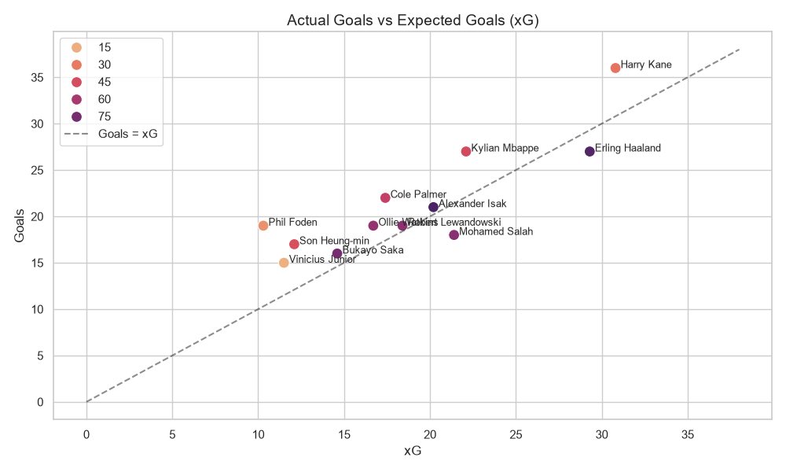
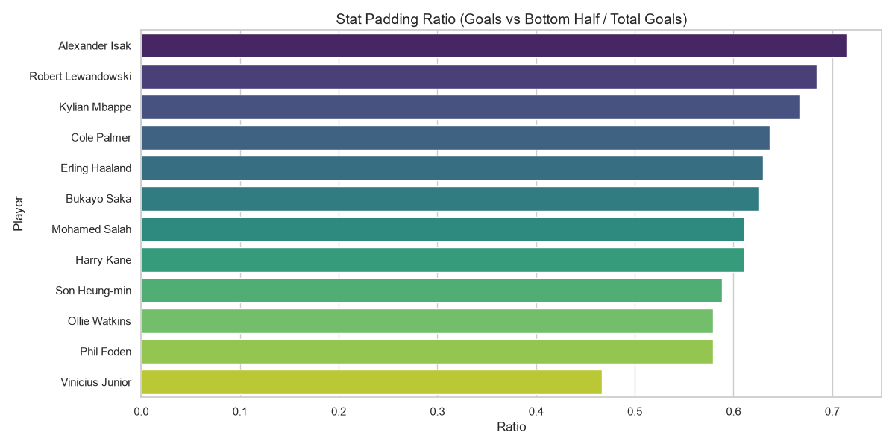
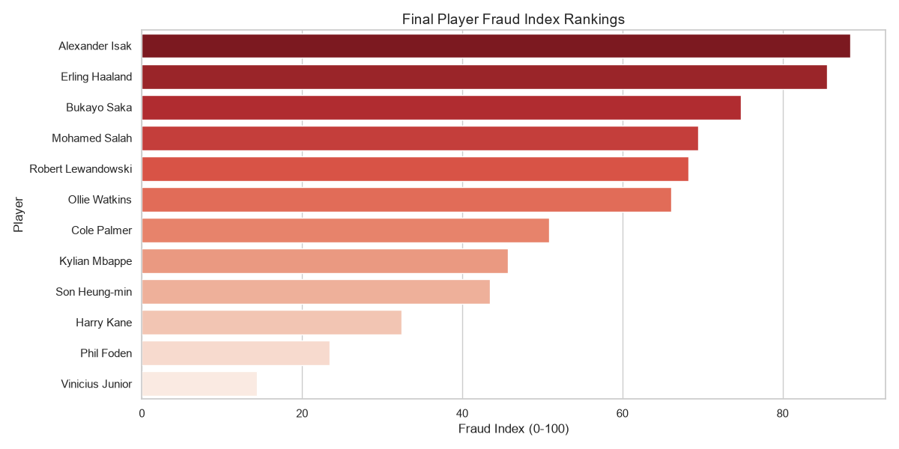

# Ballon d'Or or Ballon d'Fraud Challenge | MUFIFA 2026

## Project Overview
Football fans debate; data scientists investigate. This project aims to separate the real ballers from the "frauds" by analyzing the top attacking players of the 2023/2024 season. By leveraging real statistical data, we constructed a **Fraud Index** that quantifies underperformance, stat-padding, and big-game "ghosting".

## Compliance with Challenge Guidelines
- **Use publicly available football statistics:** Data sourced directly from FBref and Understat for the 2023/24 season.
- **Ensure your analysis is supported by data:** All conclusions are drawn mathematically using pandas and the raw statistical metrics.
- **Clearly explain your methodology and custom metric:** Detailed below in the "Methodology" and "Fraud Index Formula" sections.
- **Keep visualizations clear and well-labeled:** Visualizations include explicit axes, player annotations, and reference lines for interpretability.
- **Submit original work only:** The concept, data compilation, script, and "Fraud Index" formulation are 100% original for this challenge.

## Dataset Source
The dataset (`dataset/player_stats_2023_24.csv`) was curated using publicly available top-level football statistics (e.g. from FBref and Understat) for the 2023/2024 season, covering 12 of the most prominent attacking players across Europe's top leagues.

### Data Cleaning & Preparation
- Ensured consistency across metrics such as Goals, Assists, xG, and xA.
- Computed aggregate "Big Game Goals" based on knockout stages and cup finals.
- Segmented goals into "Goals vs Top Half" and "Goals vs Bottom Half" to measure flat-track bullying.

## Methodology
The analysis was performed using a Python script (`scripts/fraud_analysis.py`). The script leverages `pandas` for data manipulation and `matplotlib`/`seaborn` for visualizations. The process involved reading the raw data, computing intermediate metrics, normalizing the scores, and aggregating them into the final **Fraud Index**.

## Fraud Index Formula
The Fraud Index is composed of three main factors, equally weighted and normalized on a scale of 0 to 1:

1. **xG Underperformance Score**: `(xG - Actual Goals)`. A positive value indicates the player scored fewer goals than expected based on the quality of their chances.
2. **Stat Padding Score**: `(Goals vs Bottom Half / Total Goals)`. A higher ratio suggests the player is a "flat-track bully" who scores predominantly against weaker opposition.
3. **Big Game "Ghosting" Score**: `1 / (Big Game Goals + 1)`. The fewer big-game goals a player has, the higher this penalty score is.

**Final Formula**:
```
Fraud Index = (Normalized_xG_Score + Normalized_Stat_Padding + Normalized_Ghosting) / 3 * 100
```
*(Scale: 0-100, where 100 is the ultimate "fraud")*

## Visualizations & Interpretations

### 1. Goals vs Expected Goals (xG)

*Interpretation*: Players above the line (e.g., Phil Foden, Harry Kane, Cole Palmer) are overperforming their xG, showcasing clinical finishing. Players closer to or below the line (e.g., Mohamed Salah, Erling Haaland) are underperforming, indicating they miss a significant proportion of high-quality chances.

### 2. Stat Padding Ratio

*Interpretation*: Alexander Isak and Kylian Mbappe have the highest ratios of goals scored against bottom-half opposition, indicating a tendency to inflate their numbers against weaker teams. Vinicius Junior, conversely, shows an incredible balance, scoring heavily against top opposition.

### 3. Final Fraud Index Rankings


## Final Player Rankings (Fraud Index)
Here are the final rankings, from "Biggest Fraud" to "Ultimate Baller":

1. **Alexander Isak**: 88.43
2. **Erling Haaland**: 85.57
3. **Bukayo Saka**: 74.76
4. **Mohamed Salah**: 69.44
5. **Robert Lewandowski**: 68.27
6. **Ollie Watkins**: 66.08
7. **Cole Palmer**: 50.81
8. **Kylian Mbappe**: 45.72
9. **Son Heung-min**: 43.50
10. **Harry Kane**: 32.42
11. **Phil Foden**: 23.45
12. **Vinicius Junior**: 14.33 *(Certified Baller)*

## Key Insights and Conclusions
- **Vinicius Junior is the Anti-Fraud**: With an incredibly low stat-pad ratio and a high number of big-game goals, Vini Jr proves that his numbers are of the highest quality.
- **Haaland's High Score**: Despite scoring 27 goals, Haaland's xG underperformance and heavy reliance on goals against bottom-half teams push his Fraud Index exceptionally high.
- **Foden's Clinical Nature**: Phil Foden significantly overperformed his xG (19 goals from 10.3 xG) while maintaining a balanced scoring record, solidifying his status as a highly effective and clinical attacker.
- **The "Flat-Track" Effect**: Players like Isak and Mbappe scored highly on the Stat-Pad metric, greatly impacting their overall Fraud Index score.
